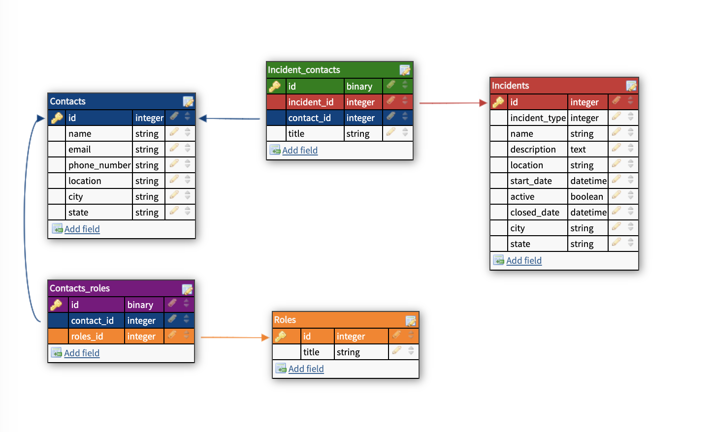

# QuickCommand Engine

## About this Project
QuickCommand Engine is the backend web application that connects client side through 13 JSON API endpoints. Each endpoint allows for basic CRUD functionality for the intended user to display both open and closed incidents as well as show what contacts are associated with the incident once an incident has been declared, create a personnel for a given incident, search for both contacts and incidents and more. Receiving current weather and hour by hour forecasts where an incident is currently active ties this functionality into the Weather API Service built with Sinatra.    

## Table of Contents

  - [Getting Started](#getting-started)
    - [Prerequisites](#prerequisites)
    - [Installation](#installation)
  - [Other Repos](#other-repos)
  - [Running the tests](#running-the-tests)
  - [Service Oriented Architecture](#service-oriented-architecture)
  - [DB Schema](#db-schema)
  - [Endpoints](#endpoints)
  - [Built With](#built-with)
  - [Versioning](#versioning)
  - [Authors](#authors)

## Getting Started

To get the web application running, please follow these directions to set up your local machine's testing and development environments. Please follow the section for deployment to see how to deploy this application on Heroku.

  ### Prerequisites
  To run this application you will need Ruby 2.5.3 and Rails 5.2.5

  ### Installation
    1. Clone this repo using the following command:
      `$ git clone git@github.com:Quick-Command/qc-engine.git/`

    2. Run bundle install:
      `$ bundle install`

    3. Setup the database:
      `$ rails db:{create,migrate,seed}`

    4. Add Environment Variables
     - First, add the Figaro gem to the development/test section of the Gemfile and `$ bundle install`: `gem "figaro"`
     - run the command `$ bundle exec figaro install`
     - Add the following environment variables to your `config/application.yml` for access to the WeatherService microservice.

     **IMPORTANT**
     It is imperative that the application.yml file is added to .gitignore so that the personal API keys are not exposed remotely.

## Other Repos

- To explore the full application capabilities, please visit the front end application which hooks into this engine and its endpoints:
  - [Repo](https://github.com/Quick-Command/QuickCommand) | [Heroku](https://quick-command.herokuapp.com/)
- For more information on the WeatherService microservice, please visit the following links
  - [Repo](https://github.com/Quick-Command/weather_service) | [Heroku](https://open-weather-service.herokuapp.com/)

## Service Oriented Architecture

## DB Schema
The following is a depiction of our Database Schema

 

## Endpoints
  ### QuickCommand API Contract  

| HTTP verbs | Paths  | Used for | Output |
| ---------- | ------ | -------- | ------:|
| GET | /api/v1/incidents?active=true | Get active incidents | [json](#active-incidents) |
| GET | /api/v1/incidents?active=false | Get resolved incidents | [json](#resolved-incidents) |
| GET | /api/v1/incidents/:incident_id  | Get an incident's details | [json](#incident-details) |
| PUT | /api/v1/incidents/:incident_id  | Update an incident's details | [json](#incident-details) |
| GET | /api/v1/incidents/:incident_id/contacts  | Get an incident's contacts and role in incident | [json](#incident-contacts) |
| GET | /api/v1/incidents/1/contact_search?role=ROLE  | Get a specific contact based on incident and role | [json](#search-incident-contact-by-role) |
| POST | /api/v1/incidents  | Create a new incident | [json](#create-a-incident) |
| POST | /api/v1/contacts  | Create a new contact | [json](#create-a-contact) |
| POST | /api/v1/incidents/:incident_id/contacts/:contact_id  | Assign a Contact to an role in an Incident | [json](#assign-a-contact-to-an-incident) |
| GET | /api/v1/contacts/:contact_id  | Get a contact's details | [json](#contact-details) |
| PUT | /api/v1/contacts/:contact_id  | Update a contact's details | [json](#update-contact) |
| GET | /api/v1/contacts?name=NAME  | Return contacts that match name query | [json](#search-contacts-name) |
| GET | /api/v1/contacts?role=ROLE  | Return contacts that match role query | [json](#search-contact-role) |

## Types of Incidents (an incident can be one type)
- Fire
- Accident
- Earthquake
- Hazmat Spill
- Power Outage
​

## Types of Roles (a contact can be many roles)
1. Incident Commander
2. Safety Officer
3. Liaison Officer
4. Operations Chief
5. Logistics Chief
​
## JSON Responses
​
## Active Incidents
`GET /api/v1/incidents?active=true`
  ```json
  {
    "data": [
        {
            "id": "6",
            "type": "incident",
            "attributes": {
                "name": "Jim Creek Fire",
                "active": true,
                "incident_type": "Fire",
                "description": "2 alarm fire caused campfire embers",
                "start_date": "2020-10-10T00:00:00.000Z",
                "close_date": null,
                "location": "Jim Creek Trail",
                "city": "Denver",
                "state": "CO"
            }
        },
        {
            "id": "7",
            "type": "incident",
            "attributes": {
                "name": "Avery Substation - Summer black out",
                "active": true,
                "incident_type": "Power Outage",
                "description": "Outage for 12893 homes for 19 hours",
                "start_date": "2020-11-10T00:00:00.000Z",
                "close_date": null,
                "location": "Avery Substation",
                "city": "Denver ",
                "state": "CO"
            }
        }
    ]
  }
  ```

## Resolved Incidents
`GET /api/v1/incidents?active=false`
  ```json
    {
      "data": [
          {
              "id": "1",
              "type": "incident",
              "attributes": {
                  "name": "October 2011 2.0 earthquake",
                  "active": false,
                  "incident_type": "Earthquake",
                  "description": "2.0 earthquake, facade damage to some buildings, 10 trees fell",
                  "start_date": "2020-01-10T00:00:00.000Z",
                  "close_date": "2020-11-05T00:00:00.000Z",
                  "location": "City Proper",
                  "city": "Denver",
                  "state": "CO"
              }
          },
          {
              "id": "5",
              "type": "incident",
              "attributes": {
                  "name": "5 car accident",
                  "active": false,
                  "incident_type": "Accident",
                  "description": "Details in police report #PR0977237619",
                  "start_date": "2020-09-10T00:00:00.000Z",
                  "close_date": "2020-10-10T00:00:00.000Z",
                  "location": "W 6TH AVE / N PERRY ST",
                  "city": "Denver ",
                  "state": "CO"
              }
          }
      ]
  }
  ```
​
## Create an Incident
`POST /api/v1/incidents`
* Set header `Content-Type` to `application/json`
* Body for request
  - Active attribute can be left out and it will default to true, or  specify `"active": false` to input a resolved incident, but you must enter a close date for an inactive incident
```json
  {
  "name": "Jim Creeks Fire",
  "incident_type": "Fire",
  "description": "5th alarm fire",
  "location": "Jims Creek",
  "city": "Denver",
  "state": "CO",
  "start_date": "2020-05-01",
  "close_date": ""
   }
```
* Required attributes: name, start date, incident type, city, state, and close date if active is false.
* Return data
```json
  {
    "data": {
        "id": "34",
        "type": "incident",
        "attributes": {
            "name": "Jim Creeks Fire",
            "active": true,
            "incident_type": "Fire",
            "description": "5th alarm fire",
            "location": "Jims Creek",
            "start_date": "2020-05-01T00:00:00.000Z",
            "close_date": null
        }
    }
  }
```

## Update an Incident
`PATCH '/api/v1/incidents/:incident_id'`
* Set header `Content-Type` to `application/json`
* Body for request
```json
  {
  "name": "Denver Zoo Fire"
   }
```
* Return Data
```json
  {
    "data": {
        "id": "1",
        "type": "incident",
        "attributes": {
            "name": "Denver Zoo Fire",
            "active": false,
            "incident_type": "Earthquake",
            "description": "2.0 earthquake, facade damage to some buildings, 10 trees fell",
            "start_date": "2020-01-10T00:00:00.000Z",
            "close_date": "2020-11-05T00:00:00.000Z",
            "location": "City Proper",
            "city": "Denver",
            "state": "CO"
        }
    }
  }
```

## Incident Details
`GET /api/v1/incidents/:incident_id`
  ```json
    {
      "data": {
          "id": "1",
          "type": "incident",
          "attributes": {
              "name": "October 2011 2.0 earthquake",
              "active": false,
              "incident_type": "Earthquake",
              "description": "2.0 earthquake, facade damage to some buildings, 10 trees fell",
              "start_date": "2020-01-10T00:00:00.000Z",
              "close_date": "2020-11-05T00:00:00.000Z",
              "location": "City Proper",
              "city": "Denver",
              "state": "CO"
          }
      }
  }
```

## Contact Details
`GET /api/v1/contacts/1`
  ```json
    {
      "data": {
          "id": "1",
          "type": "contact",
          "attributes": {
              "name": "Aaron Marks",
              "email": "AMarks@emailgov.com",
              "phone_number": " (221)830-7361",
              "job_title": "City Manager",
              "city": "Denver",
              "state": "CO"
          }
      }
  }
  ```

## Create a Contact
`POST /api/v1/contacts`
* set header `contact-type` to `application/json`
* body
  ```json
    {
      "name": "Wells Fergi",
      "email": "wfergi@email.com",
      "phone_number": "123-456-7890",
      "job_title": "Fire Commander",
      "city": "Denver",
      "state": "CO",
      "roles": ["Incident Commander", "Safety Officer"]
  }
  ```
  * return
    ```json
    {
      "data": {
      "id": "5",
      "type": "contact",
      "attributes": {
          "name": "Wells Fergi",
          "email": "wfergi@email.com",
          "phone_number": "123-456-7890",
          "job_title": "Fire Commander",
          "city": "Denver",
          "state": "CO",
          "roles": {
              "data": [
                  {
                      "id": "1",
                      "type": "role",
                      "attributes": {
                          "title": "Incident Commander"
                      }
                  },
                  {
                      "id": "2",
                      "type": "role",
                      "attributes": {
                          "title": "Safety Officer"
                      }
                  }
              ]
            }
          }
        }
      }
    ```

## Assign a Contact to an Incident
`POST /api/v1/incidents/:incident_id/contacts/:contact_id`

* Body
  ```json
    {"title": "Safety Officer"}
  ```
* Return
  ```json
    {
      "data": {
        "id": "1",
        "type": "incident_contact",
        "attributes": {
            "name": "Aaron Marks",
            "title": "Safety Officer",
            "email": "AMarks@emailgov.com",
            "phone_number": " (221)830-7361",
            "city": "Denver",
            "state": "CO",
            "distance_miles": "20",
            "distance_minutes": "40"
        }
    }
  }
  ```

## Incident Contact Details
`GET /api/v1/incidents/:incident_id/contacts/:contact_id`
  ```json
    {
      "data": {
        "id": "1",
        "type": "incident_contact",
        "attributes": {
            "name": "Aaron Marks",
            "title": "Safety Officer",
            "email": "AMarks@emailgov.com",
            "phone_number": " (221)830-7361",
            "city": "Denver",
            "state": "CO",
            "distance_miles": "20",
            "distance_minutes": "40"
        }
    }
  }
  ```

## Incident Contacts
`GET /api/v1/incidents/:incident_id/contacts`
  ```json
  {
    "data": [
        {
            "id": "1",
            "type": "incident_contact",
            "attributes": {
                "name": "Aaron Marks",
                "title": "Inicdent Commander",
                "email": "AMarks@emailgov.com",
                "phone_number": " (221)830-7361",
                "city": "Denver",
                "state": "CO",
                "distance_miles": "16",
                "distance_minutes": "49"
            }
        },
        {
            "id": "2",
            "type": "incident_contact",
            "attributes": {
                "name": "Aly Snow",
                "title": "Safety Officer",
                "email": "ASnow@emailgov.com",
                "phone_number": " (485)062-4319",
                "city": "Denver",
                "state": "CO",
                "distance_miles": "68",
                "distance_minutes": "36"
            }
        },
        {
            "id": "3",
            "type": "incident_contact",
            "attributes": {
                "name": "Brian Blue",
                "title": "Liaison Officer",
                "email": "BBlue@emailgov.com",
                "phone_number": " (852)148-9979",
                "city": "Aurora",
                "state": "CO",
                "distance_miles": "83",
                "distance_minutes": "45"
            }
        },
        {
            "id": "4",
            "type": "incident_contact",
            "attributes": {
                "name": "Brie Button",
                "title": "Operations Cheif",
                "email": "BButton@emailgov.com",
                "phone_number": " (672)832-4790",
                "city": "Littleton",
                "state": "CO",
                "distance_miles": "68",
                "distance_minutes": "77"
            }
        },
        {
            "id": "5",
            "type": "incident_contact",
            "attributes": {
                "name": "Carrie Washington",
                "title": "Logistics Chief",
                "email": "CWashington@emailgov.com",
                "phone_number": " (782)602-3793",
                "city": "Boulder",
                "state": "CO",
                "distance_miles": "26",
                "distance_minutes": "84"
            }
        }
    ]
  }
  ```

## Search Incident Contact by Role
`GET /api/v1/incidents/1/contact_search?role=Commander`
```json
{
    "data": [
        {
            "id": "1",
            "type": "incident_contact",
            "attributes": {
                "name": "Aaron Marks",
                "title": "Inicdent Commander",
                "email": "AMarks@emailgov.com",
                "phone_number": " (221)830-7361",
                "city": "Denver",
                "state": "CO",
                "distance_miles": "28",
                "distance_minutes": "100"
            }
        },
        {
            "id": "1",
            "type": "incident_contact",
            "attributes": {
                "name": "Aaron Marks",
                "title": "Inicdent Commander",
                "email": "AMarks@emailgov.com",
                "phone_number": " (221)830-7361",
                "city": "Denver",
                "state": "CO",
                "distance_miles": "47",
                "distance_minutes": "98"
            }
        },
        {
            "id": "4",
            "type": "incident_contact",
            "attributes": {
                "name": "Brie Button",
                "title": "Operations Cheif",
                "email": "BButton@emailgov.com",
                "phone_number": " (672)832-4790",
                "city": "Littleton",
                "state": "CO",
                "distance_miles": "93",
                "distance_minutes": "96"
            }
        },
        {
            "id": "4",
            "type": "incident_contact",
            "attributes": {
                "name": "Brie Button",
                "title": "Operations Cheif",
                "email": "BButton@emailgov.com",
                "phone_number": " (672)832-4790",
                "city": "Littleton",
                "state": "CO",
                "distance_miles": "39",
                "distance_minutes": "59"
            }
        },
        {
            "id": "4",
            "type": "incident_contact",
            "attributes": {
                "name": "Brie Button",
                "title": "Operations Cheif",
                "email": "BButton@emailgov.com",
                "phone_number": " (672)832-4790",
                "city": "Littleton",
                "state": "CO",
                "distance_miles": "26",
                "distance_minutes": "28"
            }
        },
        {
            "id": "6",
            "type": "incident_contact",
            "attributes": {
                "name": "Carl Jr",
                "title": null,
                "email": "CJr@emailgov.com",
                "phone_number": " (366)338-9913",
                "city": "Denver",
                "state": "CO",
                "distance_miles": "11",
                "distance_minutes": "15"
            }
        },
        {
            "id": "6",
            "type": "incident_contact",
            "attributes": {
                "name": "Carl Jr",
                "title": null,
                "email": "CJr@emailgov.com",
                "phone_number": " (366)338-9913",
                "city": "Denver",
                "state": "CO",
                "distance_miles": "6",
                "distance_minutes": "89"
            }
        },
        {
            "id": "8",
            "type": "incident_contact",
            "attributes": {
                "name": "Diane Furr",
                "title": null,
                "email": "DFurr@emailgov.com",
                "phone_number": " (227)860-8382",
                "city": "Aurora",
                "state": "CO",
                "distance_miles": "32",
                "distance_minutes": "49"
            }
        },
        {
            "id": "8",
            "type": "incident_contact",
            "attributes": {
                "name": "Diane Furr",
                "title": null,
                "email": "DFurr@emailgov.com",
                "phone_number": " (227)860-8382",
                "city": "Aurora",
                "state": "CO",
                "distance_miles": "1",
                "distance_minutes": "12"
            }
        },
        {
            "id": "9",
            "type": "incident_contact",
            "attributes": {
                "name": "Eugene Maroon",
                "title": null,
                "email": "EMaroon@emailgov.com",
                "phone_number": " (721)386-6969",
                "city": "Littleton",
                "state": "CO",
                "distance_miles": "31",
                "distance_minutes": "74"
            }
        },
        {
            "id": "9",
            "type": "incident_contact",
            "attributes": {
                "name": "Eugene Maroon",
                "title": null,
                "email": "EMaroon@emailgov.com",
                "phone_number": " (721)386-6969",
                "city": "Littleton",
                "state": "CO",
                "distance_miles": "40",
                "distance_minutes": "74"
            }
        },
        {
            "id": "11",
            "type": "incident_contact",
            "attributes": {
                "name": "Fran Moore",
                "title": null,
                "email": "FMoore@emailgov.com",
                "phone_number": " (437)750-2732",
                "city": "Denver",
                "state": "CO",
                "distance_miles": "47",
                "distance_minutes": "84"
            }
        },
        {
            "id": "11",
            "type": "incident_contact",
            "attributes": {
                "name": "Fran Moore",
                "title": null,
                "email": "FMoore@emailgov.com",
                "phone_number": " (437)750-2732",
                "city": "Denver",
                "state": "CO",
                "distance_miles": "36",
                "distance_minutes": "46"
            }
        },
        {
            "id": "26",
            "type": "incident_contact",
            "attributes": {
                "name": "Mike Moon",
                "title": null,
                "email": "MMoon@emailgov.com",
                "phone_number": " (651)563-1511",
                "city": "Denver",
                "state": "CO",
                "distance_miles": "25",
                "distance_minutes": "74"
            }
        },
        {
            "id": "27",
            "type": "incident_contact",
            "attributes": {
                "name": "Neil Buttstrong",
                "title": null,
                "email": "NButtstrong@emailgov.com",
                "phone_number": " (220)609-0224",
                "city": "Denver",
                "state": "CO",
                "distance_miles": "59",
                "distance_minutes": "38"
            }
        },
        {
            "id": "32",
            "type": "incident_contact",
            "attributes": {
                "name": "Patrick Clover",
                "title": null,
                "email": "PClover@emailgov.com",
                "phone_number": " (149)775-6018",
                "city": "Boulder",
                "state": "CO",
                "distance_miles": "28",
                "distance_minutes": "73"
            }
        }
    ]
}
```

## Built With
- Ruby
- Rails
- RSpec
- FactoryBot
- Faker

## Versioning
- Ruby 2.5.3
- Rails 5.2.6

## Authors
- **Alexa Morales Smyth**
| [GitHub](https://github.com/amsmyth1) |
  [LinkedIn](https://www.linkedin.com/in/moralesalexa/)
- **Cameron Mackintosh**
| [GitHub](https://github.com/cbmackintosh) |
  [LinkedIn](https://www.linkedin.com/in/cameron-mackintosh-1341b173/)
- **Chuck Morris**
| [GitHub](https://github.com/percworld) |
  [LinkedIn](https://www.linkedin.com/in/chuck-morris-56819918/)
- **Jeff Shepherd**
|  [GitHub](https://github.com/JeffShepherd) |
  [LinkedIn](https://www.linkedin.com/in/jefflshepherd/)
- **Jeremiah Michlitsch**
|  [GitHub](https://github.com/jmichlitsch) |
  [LinkedIn](https://www.linkedin.com/in/jeremiah-michlitsch-49048a206/)
- **Katy La Tour**
| [GitHub](https://github.com/klatour324) |
  [LinkedIn](https://www.linkedin.com/in/klatour324/)
